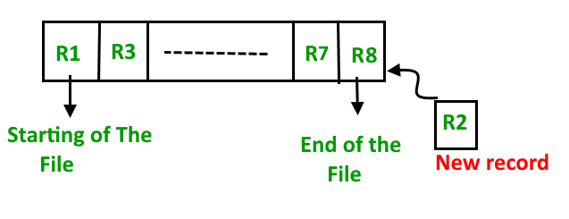
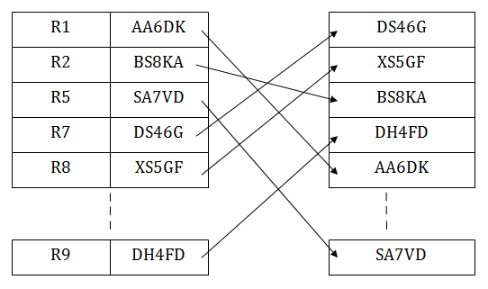

# BD2 - Proyecto 1 - Sequential File e  Indexed Sequential Access Method(ISAM)
## Integrantes
|  **#** | **Código** | **Apellidos, Nombre** |
| :---: | :---: | :---: |
|  1 | 201810010 | Barrios Silva, Alonso Winston |
|  2 | 201810010 | Lazo Pampa, David Alejandro |
## Objetivo
Conocer las dos diferentes estrucutras de archivos secuenciales, con la diferencia que uno usa indexacion.
Tener en cuenta las ventajas y desventajas de cada estructura.
## Sequential File
### Introducción
Es la forma más simple de almacenar y recuperar registros de un archivo.
En el archivo secuencial, se almacenan los registros uno tras otro.
El primer registro almacenado se coloca al principio del archivo.
El segundo se almacena inmediatamente después.

### Ejemplo
- [x] Podemos tener un control de registro por orden de llegada de asistentes.
- [x] Gestionando base de datos.
### Ventajas y Desventajas
* Ventajas 
- [x] La ventaja más importante de la técnica de organización secuencial de archivos es la capacidad de acceso al siguiente registro rápidamente.
- [x] No se desperdicia espacio en el dispositivo de almacenamiento.
* Desventajas 
- [x] Hay que realizar consultas secuenciales para acceder a un registro.
- [x] Para insertar nuevos registros, estos tienen que ser al final de todos.
- [x] Para mantener ordenado y compactado el fichero, hay que crear un fichero nuevo a partir del existente.
- [x] Si el sistema quiere leer la posición 10 tendrá que recorrer desde el primer archivo.
### Procedimiento
#### 1. Inserción
Se puede realizar de dos maneras.
1. Crear un nuevo archivo, **de alto coste**.
2. Agregarlo al final, **de bajo coste**.
* Código
```
int main()
{
	cout<<”Hola mundo”<<endl;
}
```
#### 2. Eliminación
- Eliminando el total del archivo, se logra dejar libre el espacio del soporte que ocupa.
- Cuando se borra un archivo, este ya no se puede utilizar y no se puede acceder a ningún registro.
* Código
```
int main()
{
	cout<<”Hola mundo”<<endl;
}
```

#### 3. Búsqueda
* Código
```
int main()
{
	cout<<”Hola mundo”<<endl;
}
```

## Indexed Sequential Access Method(ISAM)
### Introducción 
A diferencia del Sequential File, el ISAM usa un index, la cual nos permite acceder a un registro en particular y el proceso de secuencial a partir del inicio del archivo en cualquier otro registro del archivo.
Cada registro en el archivo se identifica por medio de un número en este caso el index que se tomaría como la llave primaria.

### Ejemplo
- [x] Si necesitas buscar un nombre en el directorio telefónico buscas el índice de la A-Z.
- [x] Sistema de Nóminas para registrar datos de empleado en específico.
### Ventajas y Desventajas
* Ventajas 
- [x] Permite procesar el archivo secuencial por orden lógico y también procesarlo al azar.
- [x] La organización indexada es conveniente para archivos con mediana volatilidad, actividad variable y tamaño relativamente estable.
- [x] Permite acceso directo al registro.
* Desventajas
- [x] Ocupa más espacios en el disco que el Sequential File, debido al uso del área de índices.
- [x] Los index requieren espacios extra, se necesita una doble búsqueda; una al archivo index y otra a la data.
- [x] Los registros tienen que tener una longitud fija.
- [x] El archivo debe estar separado por un dispositivo de acceso aleatorio: **no se puede utilizar con cintas magnéticas**.
### Procedimiento
#### 1. Inserción
```
int main()
{
	cout<<”Hola mundo”<<endl;
}
```
#### 2. Eliminación.
```
int main()
{
	cout<<”Hola mundo”<<endl;
}
```
#### 3. Búsqueda
```
int main()
{
	cout<<”Hola mundo”<<endl;
}
```
### Resultado
#### 1. Inserción
* Sequential File:

* Indexed Sequential Access Method(ISAM):

#### 2. Búsqueda
* Sequential File:

* Indexed Sequential Access Method(ISAM):

#### Métricas
#### Análisis 
### Pruebas de uso
### [Video](https://www.youtube.com/watch?v=noAGPQbdsRI)


